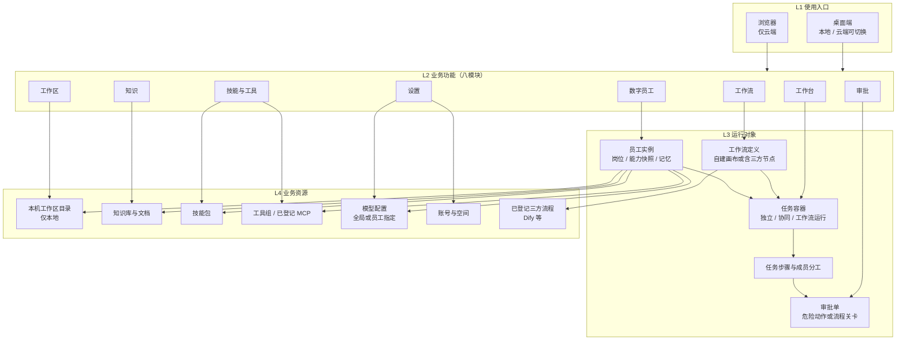
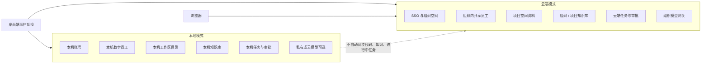
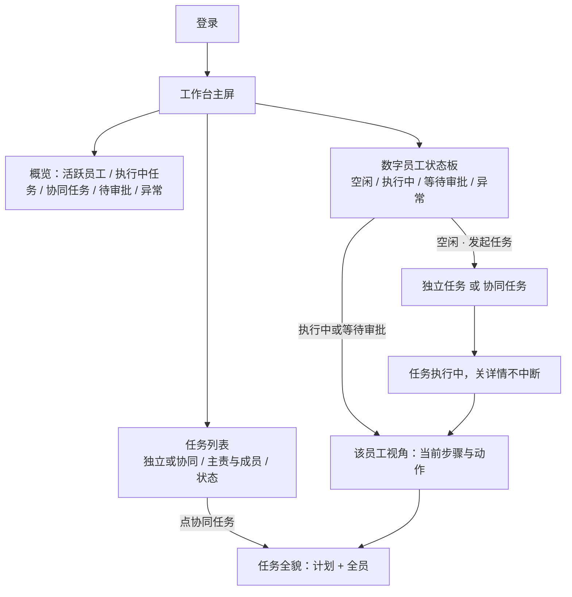
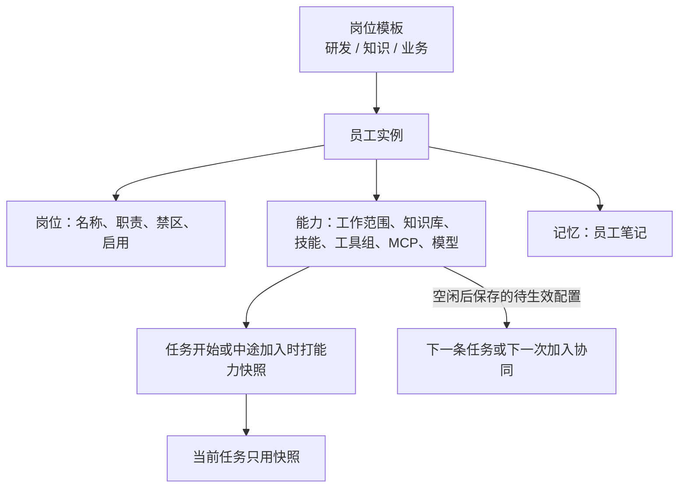
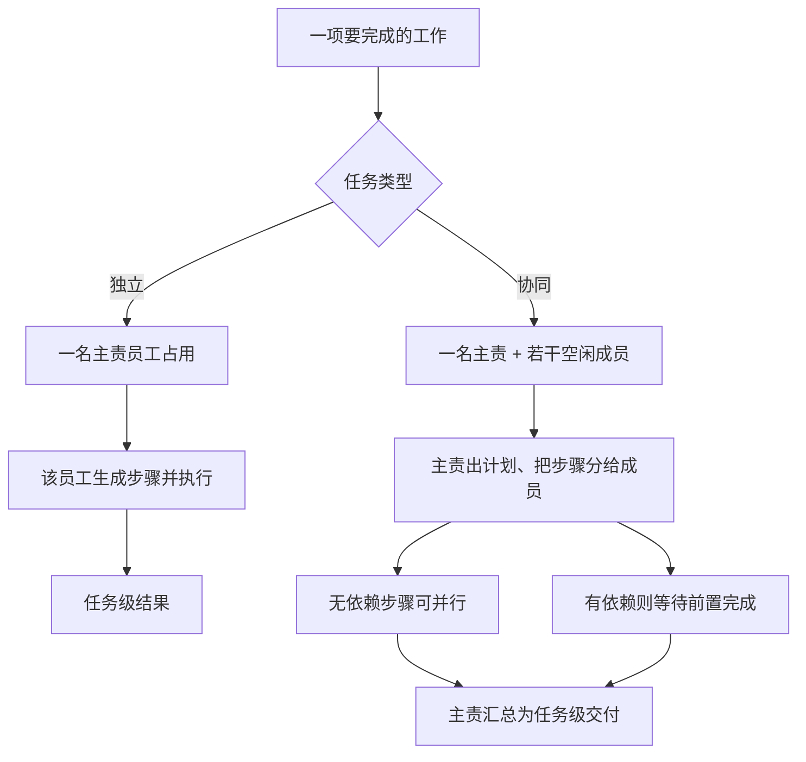
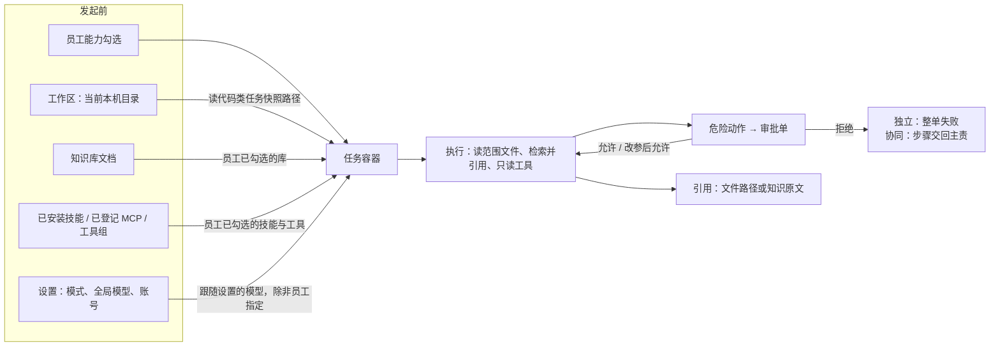
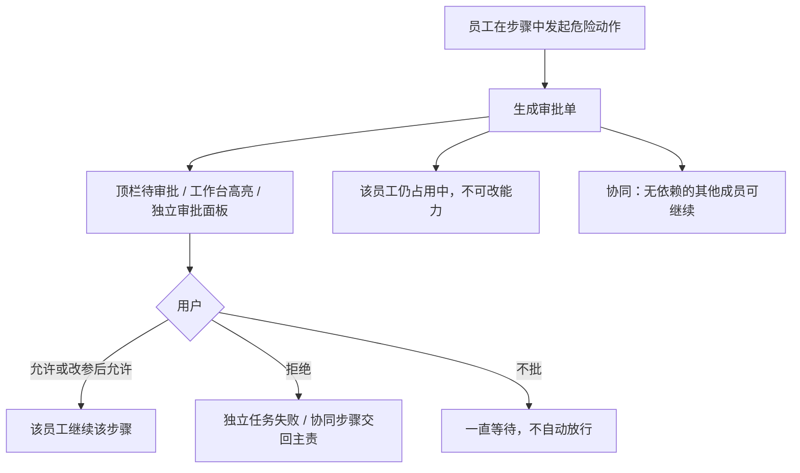
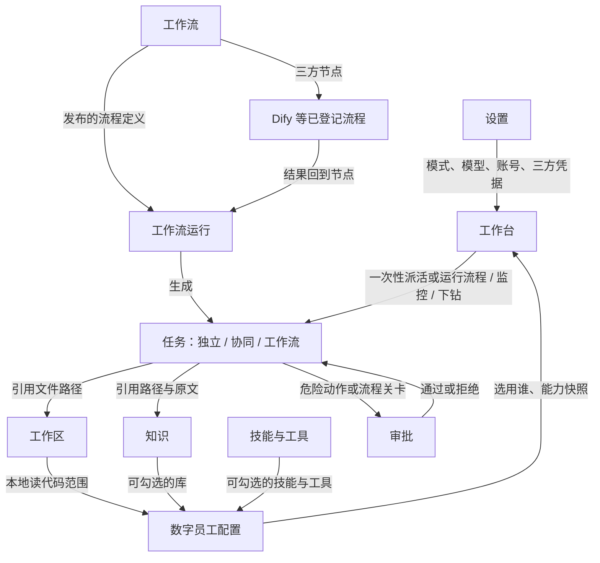
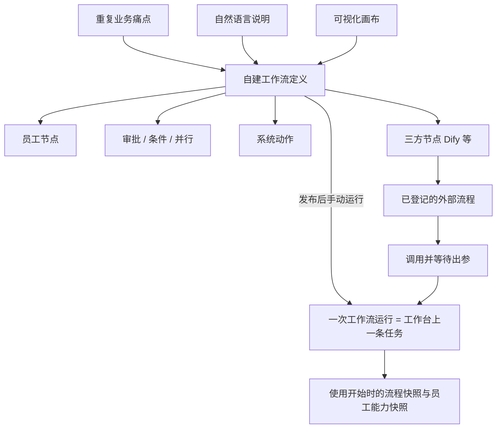

# 研发数字员工产品 — 业务功能计划（基线）

> **作者：** ernestfei  
> **日期：** 2026-09-14  
> **状态：** 已沉淀至 §1–§4.13 与 §5 业务拓扑（八模块，含工作流）。表模型与具体技术架构暂不展开。  
> **性质：** 产品功能设计计划，不是实现任务清单。技术选型与编码计划在业务功能谈完后再写。

**本文目录（已沉淀）：**

1. 已锁定决策
2. 产品定位
3. 八个业务模块与预置岗位
4. 功能呈现
   - 4.1 工作台状态模型
   - 4.2 执行详情
   - 4.3 主路径
   - 4.4 发起任务（独立 / 协同）
   - 4.5 数字员工构成与配置（岗位 / 能力 / 记忆；执行中锁能力）
   - 4.6 单员工长任务
   - 4.7 多员工协同完成一项长任务
   - 4.8 审批（动作级；长任务 / 协同中的排队与恢复）
   - 4.9 知识（库 → 文档 → 员工勾选 → 任务引用）
   - 4.10 工作区（本机单目录；任务快照；执行中不可换）
   - 4.11 技能与工具（Skill / 工具组 / MCP；按员工勾选）
   - 4.12 设置（运行模式 + 模型 + 账号）
   - 4.13 工作流（自建可视化编排 + 对接 Dify 等三方）
5. 业务层级架构拓扑（功能，不含表结构与技术栈）
6. 文档关系与下一步

---

---

## 1. 已锁定决策

| 项 | 决策 |
| --- | --- |
| 产品形态 | 独立产品，不是 IDE 插件，不是散落的聊天机器人 |
| 运行时基座 | AgentScope Java 2.0（`ReActAgent` + `HarnessAgent`） |
| 交付 | Electron 桌面端内嵌同一份 Java JAR；云端部署同一份 JAR |
| 双模式 | 桌面顶栏切换 **本地 / 云端**（方案 1：同一 JAR，两种 Runtime Profile） |
| 浏览器 | 只访问云端，与桌面「云端模式」同一套界面与功能 |
| 本地能力 | 可选私有模型；读取用户选定的本机工作区代码 |
| 建设参考 | MateClaw 的交付与双模式思路（local-embedded / remote-centralized），不采用其 Spring AI Alibaba 编排内核 |
| 第一期不同步 | 本机会话/记忆与云端各自存放，切模式不自动上传代码 |
| 工作台主屏 | 登录后为员工工作状态 + 任务状态总览，不是聊天窗 |
| 一人一任务 | 同一数字员工同一时刻只占用**一条**任务（独立或协同均可） |
| 任务即工作容器 | 说明、过程、引用、结果记在任务上；不做员工级无限聊天时间线 |
| 长任务 | 单个员工可独立执行长任务：有计划、可后台跑、关详情不中断 |
| 多员工协同 | 一项长任务可有一名主责 + 多名协作员工，共用同一任务容器 |
| 配置生效 | 岗位 / 能力 / 记忆可配；**执行中锁定能力**，改动从**下一条任务**才生效 |
| 审批 | 只审危险动作（写文件、命令等），不逐步审计划；协同中无依赖步骤可继续 |
| 知识 | 库 → 文档 → 员工勾选 → 任务内带引用；无命中须声明未检索到 |
| 工作区 | 本地仅绑一个本机目录；任务记下当时路径；执行中不可换；写出不越界 |
| 技能与工具 | 技能=流程；工具=动作；MCP=外部来源；均在员工能力中勾选，下一条任务生效 |
| 设置 | 仅三块：运行模式、模型（含私有）、账号；改模型对执行中任务不生效 |
| 工作流 | 可复用流程：自建可视化+智能调控；可把 Dify 等三方流程当节点；一次运行落成工作台任务 |

---

## 2. 产品定位

研发人员登录后先看到数字员工是否在干活、任务进展到哪一步（独立长任务或多人协同的一项长任务）；再按需点进某个活跃员工查看正在执行的内容，或发起新任务。不是一打开就是聊天窗。

- **本地模式：** 本机跑完整引擎；绑定本机工程目录；模型可选 Ollama / LM Studio / 私有 OpenAI-compatible 等。
- **云端模式：** 连接云端同一套服务；组织空间与共享员工；浏览器可直接进入。

---

## 3. 第一期呈现的 8 个业务模块

| 序号 | 模块 | 用户在做什么 | 本地模式 | 云端模式 |
| --- | --- | --- | --- | --- |
| 1 | 工作台 | 登录后主屏：员工工作状态 + 任务状态（含独立/协同长任务）；点活跃员工查看其在当前任务中的执行内容 | 有 | 有 |
| 2 | 数字员工 | 选用与配置岗位 / 能力 / 记忆；作为独立长任务主责或协同任务成员 | 本机员工 | 组织内共享员工 |
| 3 | 工作区 | 绑定本机单一工程目录；任务快照路径；执行中不可切换 | 核心 | 无本机文件夹；用项目空间 |
| 4 | 知识 | 入库、列表、检索预览、员工勾选、任务引用、删除后不可幽灵引用 | 本机知识库 | 组织/项目知识库 |
| 5 | 技能与工具 | 安装 Skill、登记 MCP、查看工具组；真正开关在员工「能力」页勾选 | 有 | 有（仅已登记来源） |
| 6 | 审批 | 动作级确认：允许 / 改参数后允许 / 拒绝；顶栏待办；工作台跳转到该条 | 桌面弹窗 + 列表 | 控制台同一面板 |
| 7 | 工作流 | 编排可复用智能流程；可视化画布+自然语言生成；运行出现在工作台；可对接 Dify 等 | 本机流程定义与运行 | 组织内共享流程；三方连接 |
| 8 | 设置 | 仅三块：运行模式、模型（含私有/跟随）、账号；切模式二次确认 | 本机账户 | SSO + 组织空间 |

### 3.1 第一期预置岗位（3 个）

在「数字员工」中选用，不做成主导航上的 9 个入口。

1. **研发助手**（默认）：解释代码、影响面、给出修改建议；本地默认可读工作区。
2. **知识助手：** 只做带引用的问答。
3. **业务助手：** 把需求收成结构化说明（问题、范围、验收、待确认项）。

架构 / 评审 / 测试 / 排障 / 安全等作为后续可启用模板，不进入第一期主导航。

### 3.2 第一期明确不呈现

- IDE 插件
- 飞书 / 钉钉等 IM 通道
- 自动合入主干、云端直读个人电脑硬盘
- MateClaw 式内容创作（图文 / 视频 / 公众号等）
- 在一次性任务/协同计划里做任意 DAG 编辑（编排只放在「工作流」模块）
- 把三方平台（如 Dify）的编辑器嵌进本产品当主画布
- 运行中由模型私自拉未勾选的员工
- 成员之间不经主责、不经用户的私下派活
- 跨任务的员工自动组队市场
- 从对话一键生成技能并全员启用
- 关机后本机长任务自动恢复（云端任务除外）
- 审批转给其他人、批量通过所有命令、超时自动放行
- 云端模式读取未入库的本机文件
- 自动把会议纪要升成架构事实
- 在知识库里当 IDE 改代码
- 多仓库同时挂载、自动索引整个用户主目录
- 云端把个人私有仓 checkout 到服务器当工作区
- MateClaw 式 LLM Wiki 自动成网（第一期只做知识库+文档）
- 运行时安装未知 MCP 包
- 技能从对话一键全员上架（与「从对话一键生成技能」同属禁止）
- 多用户抢同一个本机工作区、用量计费页、设置里的外观实验室（主题除外可后补）

---

## 4. 功能如何呈现

桌面端与云端控制台共用同一套信息架构；仅顶栏模式与数据范围不同。

```text
┌─────────────────────────────────────────────────────────────┐
│  产品名     [ 本地 | 云端 ]              待审批(n)   设置/用户 │
├────────────┬────────────────────────────────────────────────┤
│ 工作台 ●    │  概览：活跃员工数 / 执行中任务 / 协同任务 / 待审批 / 异常 │
│ 数字员工    │                                                │
│ 工作区      │  数字员工状态板                                  │
│ 知识        │  姓名 | 空闲/执行中/等待审批/异常 | 当前任务(独立/协同) │
│ 技能与工具  │                                                │
│ 工作流      │                                                │
│ 审批        │  任务状态列表                                    │
│ 设置        │  标题 | 独立/协同/工作流运行 | 主责与成员 | 状态   │
│            │                                                │
│            │  点活跃员工 → 执行详情（个人步骤 + 所属长任务全貌）   │
│            │  协同任务可切换查看各成员正在做什么                 │
└────────────┴────────────────────────────────────────────────┘
```

呈现原则：

1. **工作台是登录后的主屏幕，但是状态总览，不是聊天窗。** 先看谁在干活、任务到哪一步。
2. **活跃员工可下钻。** 点击「执行中 / 等待审批」的员工，查看该员工当下任务的目标、步骤、工具调用、输出与待确认项。
3. **空闲员工从工作台发起任务。** 轻量派活后生成任务并回流状态板，不是一登录就进聊天。
4. **模式切换在顶栏，全局可见。** 切到云端时提示本机会话留在本地、窗口改连云端；切回本地不自动上传代码。
5. **工作区仅在本地模式强调。** 未绑定工程目录时，工作台顶部横幅：「选择本机仓库后才能读代码」。
6. **危险操不当聊天气泡。** 审批用独立面板；工作台上「等待审批」可一键跳到该条审批。
7. **知识回答必须带引用。** 无来源则标明「未检索到」。
8. **浏览器 = 云端模式的网页版。** 无「选择本机文件夹」，设置中无本地模型。
9. **长任务关详情不中断。** 独立与协同均如此；退出本机应用会提示中断，云端关浏览器不中断。
10. **协同是一条任务多人占用。** 状态板上相关员工显示同一任务标题；一人同一时刻只占一条任务。
11. **重复发生的业务用工作流，一次性派活用任务。** 工作流运行会出现在工作台，与独立/协同任务同一套状态板。

### 4.1 工作台状态模型（第一期）

**数字员工工作状态（互斥）：**

| 状态 | 含义 | 主屏展示 |
| --- | --- | --- |
| 空闲 | 无进行中任务 | 可「发起任务」 |
| 执行中 | 正在跑当前任务 | 显示任务标题与已耗时；可点进看执行内容 |
| 等待审批 | 任务卡在危险操作确认 | 高亮；可点进看待确认命令/文件 |
| 异常 | 任务失败或引擎不可用 | 显示失败摘要；可重试或查看日志 |

**任务状态（一条任务：独立长任务、协同长任务，或一次工作流运行）：**

| 状态 | 含义 |
| --- | --- |
| 排队 | 已提交，尚未开始 |
| 执行中 | 思考 / 读文件 / 调工具 / 成员协作进行中 |
| 等待确认 | 至少一个阻塞步骤需人类审批 |
| 已完成 | 有结果可回看 |
| 已失败 | 出错结束 |
| 已取消 | 被用户打断整单 |

占用规则：同一员工同一时刻只占用**一条**任务（含工作流运行占用的员工）。已占用时不能再被派独立活、不能加入另一项协同、也不能再被另一条工作流拉起。提示「该员工正在工作，请先打断或等完成」。

任务列表展示：标题、类型（独立 / 协同 / 工作流）、主责、成员数、状态、耗时。协同或工作流占用多名员工时，状态板上都指向**同一条任务标题**。

### 4.2 活跃员工执行详情（下钻）

用户点击活跃员工后必须能看到：

- 所属任务：标题、类型（独立/协同）、发起人、开始时间
- 若协同：主责、成员列表及每人子状态（执行中 / 等待 / 已完成自己的步骤）
- 长任务计划：步骤列表，哪一步在执行、谁在做
- 该员工当下：读哪个文件、调用哪个工具、是否在生成回答
- 关键输出摘要与引用
- 操作：追问（仍属本任务）、打断整单、仅停止该成员（仅协同）、去审批、看完整过程

点任务列表中的协同任务，进入**任务全貌**（计划 + 全员），再点某个成员看其过程。点员工状态板则先落到「该成员视角」，可一键切到任务全貌。

### 4.3 主路径

- **本地独立长任务：** 登录 → 工作台 → 对空闲员工发起「独立任务」→ 状态板执行中并打开详情 → 关详情任务继续跑（只要本机 JAR 未退出）。
- **本地/云端协同长任务：** 发起时选「协同」并勾选其他空闲员工 → 生成一条任务、多名员工同时占用 → 工作台看到同一任务标题 → 点任一成员或点任务看全貌。
- **云端：** 浏览器登录或桌面切云端；协同任务在服务端继续跑，关浏览器不中断。

### 4.4 发起任务

从工作台点空闲员工的「发起任务」（配置页也可）。轻量派活，增加任务类型。

```text
┌ 发起任务 ────────────────────────────────────────┐
│ 主责员工：研发助手（当前所选）                      │
│ 类型： ( ) 独立任务    (•) 协同任务                 │
│                                                  │
│ 要完成什么 *                                      │
│ [ 长任务说明                                ]     │
│                                                  │
│ 协同成员（仅协同；仅列出空闲员工）                   │
│  [x] 业务助手  [x] 知识助手  [ ] （忙碌的不可选）   │
│                                                  │
│ 补充（可选）文件/目录                               │
│            [ 取消 ]     [ 开始任务 ]              │
└──────────────────────────────────────────────────┘
```

| 项 | 规则 |
| --- | --- |
| 必填 | 任务说明。生成任务标题（过长截断，全文留在任务内） |
| 独立 | 仅占用主责一名员工 |
| 协同 | 主责 + 至少一名其他空闲员工；忙碌员工不可选 |
| 选填 | 相关文件/目录。本地未绑工作区时，不可对研发助手派「读代码」类任务 |
| 不填 | 优先级、截止日期、逐步 DAG 手工编排。计划由主责在任务内生成，用户可看可打断 |
| 占用中 | 该员工发起入口禁用 |

**点「开始任务」之后：**

1. 生成**一条**任务（独立或协同），状态由排队转入执行中。
2. 所有入选员工状态改为执行中，状态板标题相同。
3. 自动打开执行详情：独立则主责视角；协同则任务全貌。
4. 可关详情回总览，长任务继续。
5. 任一阻塞审批：相关员工「等待审批」，任务为「等待确认」；并行且不依赖该步骤的其他成员可继续。
6. 整单完成 / 失败 / 取消后，所有占用员工回到空闲；任务可回看。

**任务与过程记录：**

- 一条任务是容器：说明、计划、各成员过程、引用、最终结果。
- 多次派活 = 多条任务历史。
- 追问补一句 = 同一长任务续跑，不新开任务。
- 换一件完全不同的事：等结束或打断整单后再发起。

### 4.5 数字员工构成与配置

构成六块，配置页三栏呈现：**岗位 | 能力 | 记忆**。用户动作：选用、配置、经「发起任务」派活。

| 栏 | 内容 | 第一期 |
| --- | --- | --- |
| 岗位 | 名称、模板类型、一句话职责、禁区、启用 | 模板类型创建后不可改；关闭启用则工作台不出现、不能派活或入协同 |
| 能力 | 工作范围、知识库、技能、工具组、模型 | 写文件/命令默认关，打开后仍审批；知识助手隐藏或不生效写工具 |
| 记忆 | 该员工笔记摘要 | 可浏览、可清空；不提供从对话一键生成技能并全员启用 |

硬规则：

1. 权限跟员工走。知识助手不能写文件或 shell。
2. 研发助手本地默认可读、不可写；写与命令必须审批。
3. 员工不共享未绑定的工具。协同时每人只用**自己的**能力快照，主责不能把知识助手变成写代码的人。

**执行中锁能力，下一条任务才生效：**

- 员工处于执行中 / 等待审批时，能力页只读；岗位名称可改。
- 保存的能力、知识、技能、工具、模型改动写入「待生效配置」，**当前长任务（含协同里该成员已开始的部分）仍用开始时（或加入时）的快照**。
- 该员工回到空闲后，待生效配置成为当前配置，对其**下一次**独立任务或下一次加入的协同生效。
- 协同进行中把某空闲员工中途拉入：以**加入那一刻**的能力快照锁定，直到该协同任务结束。

### 4.6 长任务（单员工独立执行）

长任务不是多聊几句，而是**有计划、可离开、可回来接着看**的一条工作。

| 能力 | 产品行为 |
| --- | --- |
| 计划 | 开始后主责生成步骤列表（用户可见：待做 / 进行中 / 完成 / 失败） |
| 后台 | 关闭执行详情、切换到其他菜单，任务继续 |
| 本地存活 | 桌面端与内嵌 JAR 仍在运行则继续；退出应用前需提示「有长任务在跑，退出将中断」 |
| 云端存活 | 关浏览器不中断 |
| 进度 | 工作台显示当前步骤短标题与耗时 |
| 续跑 | 详情内追问、补充文件，仍属本任务 |
| 打断 | 用户打断整单，步骤停止，员工空闲，任务「已取消」 |
| 失败 | 当前步骤失败则任务失败（第一期不做自动从某步重试整单；可从详情「从失败步骤重试」仅限独立任务） |

第一期不要求：跨天定时自动唤醒、用户关机后本机任务自动恢复（云端任务除外）。

### 4.7 多数字员工协同完成一项长任务

**一条协同任务 = 一个目标 + 一名主责 + 若干成员。** 不是多个互不相干的任务钉在一起。

| 角色 | 做什么 |
| --- | --- |
| 主责 | 理解总目标、生成/调整计划、把步骤分给成员、汇总最终结果。默认发起时点的那名员工 |
| 成员 | 只执行分给自己的步骤，使用自己的岗位能力与知识 |
| 用户 | 选定主责与成员、看全貌、追问、审批、打断整单或停止某成员 |

协同规则：

1. **先选人再开工。** 第一期不在运行中由模型私自拉未勾选的员工。主责可在任务内「申请增加成员」：只列出空闲员工，**用户确认**后加入，并锁定加入时能力快照。
2. **计划可见。** 步骤上标明负责人（主责或某成员）、依赖（可并行的标出来）。无依赖的步骤可同时执行（对应员工并行占用同一条任务）。
3. **成员视角与任务全貌。** 工作台点某成员看到「他正在做步骤 2：检索登录规范」；切全貌看到整张计划。
4. **结果归总任务。** 成员产出交给主责汇总，用户在任务级看最终交付，而不是去每个员工聊天里拼。
5. **停止某成员。** 该成员回空闲，其步骤标失败/已交回；主责可改派给其他已在本任务内且空闲下来的成员，或申请增加成员。整单仍在。
6. **打断整单。** 全部占用员工回空闲。
7. **审批。** 谁触发危险操作谁进入等待审批；阻塞后续依赖步骤；不依赖的并行步骤继续。
8. **不能把协同当成给忙碌员工加塞。** 未入选且忙碌的员工进不来。

协同发起示例：主责业务助手 + 成员知识助手、研发助手 → 一项「需求澄清并评估代码影响」长任务。业务助手出结构化说明，知识助手补规范引用，研发助手出影响面，业务助手汇总。工作台上三人状态都指向同一任务标题。

不做（本阶段）：在一次性协同计划里做任意 DAG 编辑、跨任务的员工自动组队市场、成员之间不经主责的私下派活。可复用编排一律放「工作流」模块。

### 4.8 审批（动作级）

审批只处理**危险动作**（写文件、执行命令等），不是审整段计划。计划默认可见、可打断，不必逐步点头。

一条审批单绑定：任务、步骤、哪个员工、什么动作（路径/命令）、允许用户改参数。

| 场景 | 行为 |
| --- | --- |
| 独立长任务 | 该员工变为「等待审批」，任务「等待确认」，整单停在该步骤 |
| 协同 · 阻塞步骤 | 触发人「等待审批」；依赖它的后续步骤不开始；无依赖的并行成员继续 |
| 协同 · 多人同时要批 | 审批列表多条，互不覆盖；各条通过后对应步骤才继续 |
| 通过 | 该员工从等待回到执行中，使用（可被用户改过的）参数继续 |
| 拒绝 | 该步骤失败。独立任务整单失败。协同则该步骤交回主责，主责改计划或改派，**不默认整单失败** |
| 超时不批 | 第一期不自动通过；一直停在等待，工作台保持高亮 |

呈现：

- 顶栏「待审批 (n)」为当前用户待办条数；可进审批模块，也可从工作台员工行跳到**这一条**。
- 审批面板独立，不混在聊天气泡：任务标题、员工、步骤、动作详情、允许 / 修改参数后允许 / 拒绝。
- 工作台等待中员工高亮；协同任务全貌上该步骤标「待你确认」。
- 本地：桌面弹窗，同时出现在审批列表。云端：同一面板；关浏览器任务仍等待，回来还能批。

规则：

1. **人只批动作，不替员工选工具。** 拒绝后由主责或该员工改道，用户不必在审批里重写任务说明。
2. **等待审批仍算占用中**，不能改该员工能力（与配置锁一致）。
3. 第一期不做：审批转交、批量通过所有命令、超时自动放行。

### 4.9 知识

知识是给数字员工用的**带出处的资料**，不是另一个聊天窗口。工作台/任务里的引用应能点回原文；「知识」菜单负责入库、看来源、删除。

第一期只做 **知识库** 这一层：一个库是一组文档。本地默认一个「本机知识库」，可再建多个；云端按项目空间建库。不做 Wiki 自动长成网状百科。

| 能力 | 用户侧 | 本地 | 云端 |
| --- | --- | --- | --- |
| 入库 | 上传文件 / 导入目录中的文档 | 本机知识，不出机器 | 组织知识 |
| 列表 | 标题、来源、更新时间、是否过期 | 有 | 有 |
| 检索预览 | 搜一下看命中片段 | 有 | 有 |
| 绑定员工 | 在员工「能力」里勾选可用知识库 | 有 | 有 |
| 任务内引用 | 回答带链接或路径，点开看片段 | 有 | 有 |
| 删除 | 删文档后员工不得再引用幽灵内容 | 有 | 有 |

与员工、任务的关系：

- **知识助手：** 默认绑定当前模式可见的全部库。
- **研发助手：** 默认可不绑库；先读工作区代码，需要规范时再检索已绑的库。
- **业务助手：** 默认绑领域/需求类库（若已有）。
- 任务进行中改绑定 = 能力变更，**下一条任务才生效**。
- 无命中必须说「未检索到」，禁止编造来源。

不放进第一期：云端去读未入库的本机文件；自动把会议纪要升成架构事实；在知识库里改代码。

### 4.10 工作区

工作区是本地模式下数字员工能碰的**本机工程目录**。不是 Git 托管，也不是云端磁盘。云端模式没有「选择本机文件夹」，只用项目空间（已入库资料），不能直读硬盘。

| 能力 | 行为 |
| --- | --- |
| 绑定 | 在「工作区」选择一个本机目录（或从工作台横幅进入） |
| 范围 | 研发助手只读该目录及其子路径；禁止读目录外 |
| 展示 | 路径、是否有效、最近用过的若干目录（不自动扫描全盘） |
| 与任务 | 发起读代码类任务时带上当前工作区；任务快照记下当时路径 |
| 切换目录 | 有员工正在跑任务时不能换；空闲后切换，对**下一条任务**生效 |
| 未绑定 | 工作台横幅提示；不能对研发助手派读代码任务；知识/业务助手仍可问已入库知识 |

规则：

1. **一个运行模式下一期只绑一个当前工作区。** 要看另一个仓库，先结束占用中的任务再换。
2. **写文件若在审批中被允许，也只能写在该工作区内。** 不能批准写出目录外。
3. **切到云端不上传工作区。** 本地目录留在本机。
4. 第一期不做：多仓库同时挂载、自动 index 家目录、云端 remote checkout 私有仓到服务器当工作区。

### 4.11 技能与工具

技能没有独立「运行」按钮，只在任务中被该员工使用。

| | 用户感知 | 第一期 |
| --- | --- | --- |
| **技能 Skill** | 教员工按什么流程做（检查清单、输出格式） | 安装/卸载 `SKILL.md` 包，在员工能力里勾选 |
| **工具** | 员工能调用的动作（读文件、检索、命令等） | 按组开关；写文件/命令默认关，打开后仍走审批 |
| **MCP** | 接到外部系统的工具来源 | 仅从已登记来源添加；绑到具体员工，不全局泄漏 |

呈现：

- **技能与工具**菜单：已安装技能、已连接 MCP、工具组说明（总览，只读含义）。
- **真正开关在员工配置的「能力」页：** 勾选技能、打开工具组、绑定 MCP。未勾选的，该员工任务里不可见。
- 执行中改勾选 = 能力变更，**下一条任务生效**。

规则：

1. **按员工绑定。** 给业务助手装的需求类 MCP，不会出现在知识助手里。
2. **工具组下限由岗位模板封顶。** 知识助手看不到或打不开写文件/命令。
3. **外部 MCP 不能运行时随便装未知包。** 第一期仅允许已登记来源。
4. **不能从对话一键生成技能并全员上架。**

第一期预置工具组：`检索`、`读代码`（依赖工作区）、`知识库`；`写文件`、`命令` 默认关。

### 4.12 设置（模式 + 模型 + 账号）

设置第一期只放三块，不做控制台大杂烩。顶栏的本地/云端开关与设置中的运行模式是同一件事。

| 项 | 本地模式 | 云端模式 |
| --- | --- | --- |
| **运行模式** | 顶栏可切；设置里说明后果：切云端不上传工作区与本机知识 | 切回本地则连接本机内嵌 JAR |
| **模型** | 全局默认模型；可选 Ollama、LM Studio、私有 OpenAI-compatible、云厂商。员工能力可「跟随设置」或指定一个 | 企业模型网关；无本机 Ollama 项 |
| **账号** | 本机用户（第一期本机账户或首次启动创建） | SSO；显示当前组织/空间 |

规则：

1. **模式切换二次确认。** 本机会话留在本地；云端任务不带到本机；不上传代码目录。
2. **改全局模型对执行中任务不生效。** 与配置锁相同，下一条任务才用新模型。员工指定了自己的模型时，优先员工配置。
3. **密钥只进设置，不进任务记录和员工笔记。**
4. 第一期不做：多用户抢同一个本机工作区、用量计费页、设置里的外观实验室。

主路径：

- 本地：设置 → 选私有模型并测通 → 工作区已绑定 → 工作台派活。
- 云端：SSO → 选空间 → 用组织模型 → 工作台。

### 4.13 工作流（自建编排 + 三方对接）

工作流是**可复用的业务过程定义**，用来解决反复出现的编排痛点。它不是工作台上的一次性「发起任务」，也不是协同长任务里由主责临时生成的计划。

| | 一次性任务 / 协同 | 工作流 |
| --- | --- | --- |
| 目的 | 这一次要把这件事做完 | 这类事以后按同一套步骤反复做 |
| 计划从哪来 | 主责在运行中生成 | 发布前在工作流模块编排好 |
| 可视化 | 运行时看步骤列表，不提供任意画布 | **可视化画布** + 自然语言生成/改流程 |
| 一次运行 | 一条任务 | 一次「工作流运行」，在工作台上仍表现为一条任务 |

典型痛点（第一期要对准的场景，可做成预置模板）：

1. 需求澄清 → 查规范 → 代码影响面 → 汇总（业务+知识+研发助手）
2. 文档入库后的处理：切片说明、补引用、通知知识助手可答
3. 发布前检查：只读检查清单 + 人工审批节点（不自动上线）

#### 自建工作流

「工作流」模块三块页面：

- **流程列表：** 草稿 / 已发布 / 已停用；预置模板与自建
- **编排画布：** 可视化节点与连线；可用自然语言「生成或修改流程」再落到画布上改
- **运行记录：** 跳到工作台对应任务

第一期节点类型（业务含义，不规定实现）：

| 节点 | 作用 |
| --- | --- |
| 员工节点 | 指定一名数字员工执行一段说明；占用规则与任务相同 |
| 审批节点 | 流程级关卡（与动作级审批都进审批模块，类型标「流程关卡」或「危险动作」） |
| 条件 / 分支 | 按上一节点结果走不同路 |
| 并行 | 多个员工节点同时进行（所选员工必须当时空闲） |
| 系统动作 | 写入知识（受知识模块约束）、发任务结果摘要 |
| 三方工作流节点 | 调用已登记的 Dify 等外部流程，等待结果再继续 |

智能调控（第一期）：

- 编排时：自然语言生成草稿、指出缺审批/缺员工的步骤
- 运行时：某节点失败可「跳过（须确认）/ 重试 / 改派空闲员工」；不由模型私自改已发布定义
- 发布后的定义修改**不影响进行中的运行**（与能力锁同一思想：运行用开始时的流程快照）

触发：第一期以**手动运行**（工作流页或工作台「运行流程」）为主。定时、事件触发可后补，不阻塞模块成立。

运行时：创建一条类型为「工作流」的任务，占用流程上涉及的员工；工作台可下钻到当前节点与外部调用状态。关详情不中断。员工忙碌则该运行在启动时失败并提示，不抢占。

#### 对接三方工作流（Dify 等）

本产品不内嵌 Dify 编辑器。三方是**已登记的外部能力**，以节点形式编进自建流程，或作为「仅运行外部流程」的快捷方式。

| 能力 | 行为 |
| --- | --- |
| 登记 | 在工作流模块添加连接：平台类型（Dify 等）、名称、入口（应用/流程标识）、密钥只进设置类凭据、不出任务日志 |
| 探测 | 拉取可调用的流程列表与入参/出参说明（平台支持的范围内） |
| 编入画布 | 「三方节点」绑定某个已登记流程，映射本流程上下文 → 入参，出参 → 后续节点 |
| 单独运行 | 可从列表「运行该外部流程」，仍在工作台生成一条任务，便于状态与审批统一 |
| 失败 | 外部超时/失败显示在任务详情；可重试该节点；不把外部内部日志当成本地知识除非用户明确入库 |

第一期对接范围：以 Dify 为样板（工作流/对话应用调用、同步等待结果）。其他平台用同一套「登记 → 映射 → 节点 → 运行」业务模型扩展，不各做一套菜单。

规则：

1. **自建是编排主体，三方是节点。** 数字员工、审批、工作区/知识边界仍由本产品执行，不交给 Dify 直读本机硬盘。
2. **出站数据最小化。** 调三方只传该节点映射的字段；默认不传完整工作区。
3. **本地模式**可用自建流程 + 本机员工；调 Dify 等于调用外部服务，需用户在设置/工作流里显式启用该连接。云端同理，凭据归组织。
4. 不做：在画布里实时编辑 Dify 图、把本产品当 Dify 运行时、无登记的任意 URL 当工作流。

---

## 5. 业务层级架构拓扑

本节只描述**业务功能怎么分层、怎么连在一起**。不包含数据表、中间件、进程或框架选型。

### 5.1 业务分层（从上到下）



| 层 | 职责 | 不做什么 |
| --- | --- | --- |
| L1 入口 | 人从哪进来、本地还是云端 | 不承载岗位逻辑 |
| L2 八模块 | 人操作的菜单与页面 | 不直接等于一个员工或一条任务 |
| L3 运行对象 | 正在发生的工作：员工占用、任务、步骤、审批 | 不存「全公司一张表」这类实现问题 |
| L4 资源 | 被绑定、被引用、被快照的配置与资料 | 执行中改资源不对当前任务生效 |

### 5.2 双模式业务边界（不上传、不共用运行中任务）



切换时业务上只换**数据范围与入口**，八个模块的菜单结构不变。浏览器没有工作区选文件夹、没有本机私有模型项。

### 5.3 工作台：员工状态 × 任务容器



一人同一时刻只占用一条任务；协同时多名员工的状态行指向**同一任务标题**。

### 5.4 数字员工构成与配置锁



执行中 / 等待审批时能力页只读。协同时每人只用自己的快照，主责不能把知识助手变成写代码角色。

### 5.5 独立长任务 vs 协同长任务



协同补充：

- 先选人再开工；运行中加成员须用户确认。
- 可打断整单，或只停止某成员（步骤交回主责）。
- 不经主责、不经用户的成员互派，第一期不做。

### 5.6 资源如何进入一次任务



本地未绑工作区时，不能对研发助手派读代码任务。写文件即使审批通过也不得写出工作区外。

### 5.7 审批在业务链上的位置



审批的是动作，不是整份计划。

### 5.8 八模块协作总图



人的日常路径：**设置就绪 → 工作台看状态 → 一次性派活或运行已发布工作流 → 盯任务与审批 → 重复业务去工作流模块编排。**

### 5.9 工作流业务拓扑



与一次性协同的边界：协同计划只服务**这一次**任务；工作流定义服务**这一类**任务。禁止在协同详情里打开完整编排画布。

---

## 6. 文档关系与下一步

| 文档 | 作用 |
| --- | --- |
| 本文 `docs/superpowers/plans/2026-09-14-rd-digital-employee-product.md` | 已锁定的业务功能、呈现与业务拓扑 |
| `docs/superpowers/specs/2026-09-14-ai-digital-employee-design.md` | 早期平台架构草稿（待业务拓扑确认后按 Java 基座改写） |
| 后续实现计划 | 业务与拓扑稳定后再拆任务 |

**下一步探讨（未锁定）：** 工作流预置模板清单是否要增删；表模型与具体技术架构仍暂不展开。
