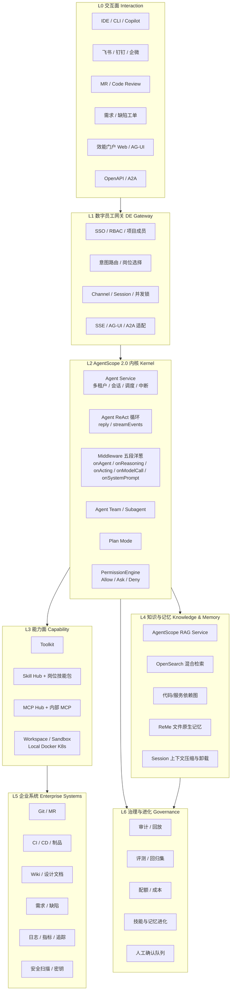
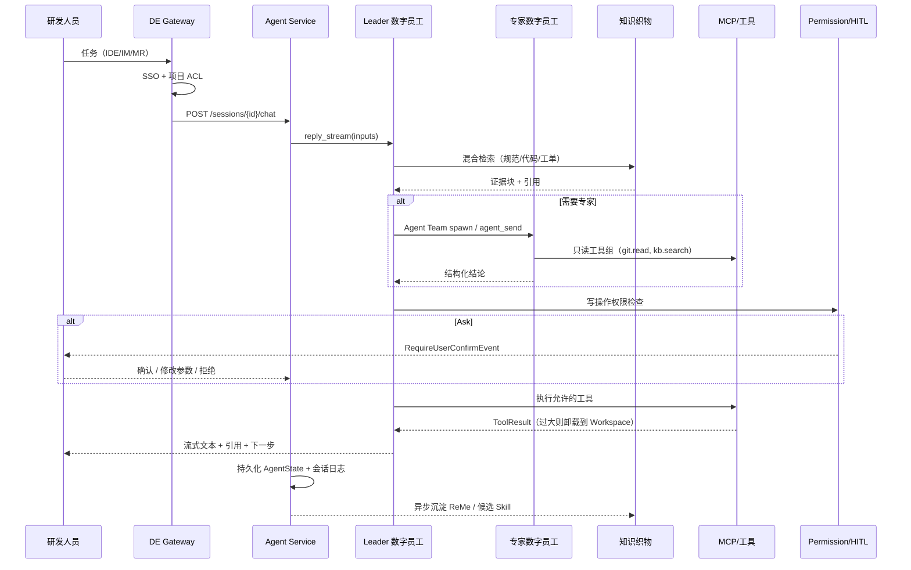
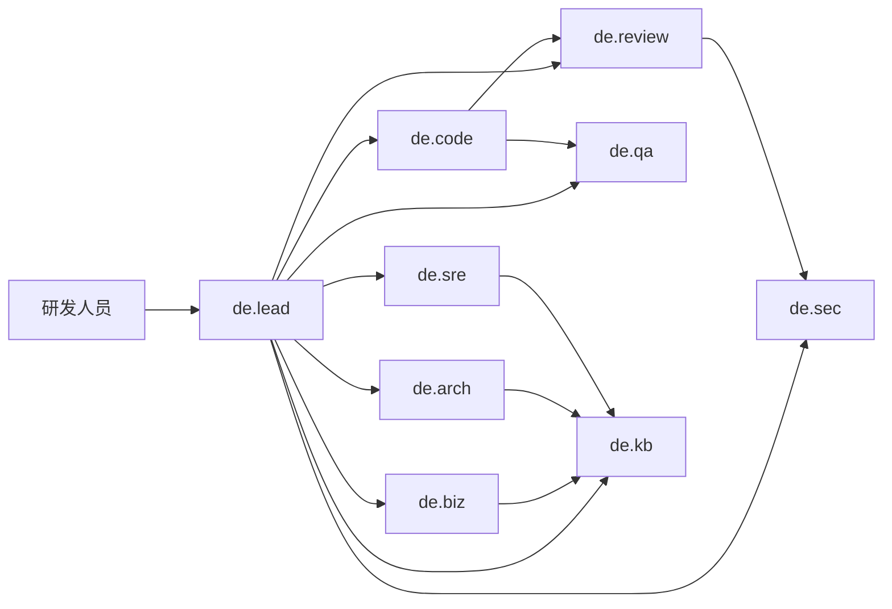

# 基于 AgentScope 2.0 的研发 AI 数字员工架构设计

> **作者：** ernestfei  
> **日期：** 2026-09-14  
> **状态：** 架构规格（Spec）  
> **范围：** 研发部门 AI 效能提效（业务 AI、知识库、AI 工具、数字员工运行时）  
> **基座：** AgentScope Python 2.0（[docs.agentscope.io](https://docs.agentscope.io/stable/en/index)），必要时以 AgentScope Java 2.0 作为企业侧集成补充  
> **仓库：** `ai-spce-engineering`

---

## 0. 文档怎么读

本文是一份**可落地的平台架构规格**，不是概念白皮书。目标读者是研发效能负责人、架构师、平台工程与 Agent 开发者。

阅读路径：

1. 先看第 1–3 节，确认问题、原则与路线选择。
2. 再看第 4–5 节，抓住总体分层与 AgentScope 2.0 映射。
3. 然后按职责深入：数字员工目录（第 6 节）、知识库（第 7 节）、工具（第 8 节）、业务 AI（第 9 节）。
4. 工程落地看第 10–15 节：记忆进化、治理、可观测、部署、分阶段建设。

**本文不进入实现代码。** 后续每个子系统应拆成独立 Spec → Plan → 实现循环。本文第 16 节给出拆分建议。

---

## 1. 背景与要解决的问题

### 1.1 研发效能的真实瓶颈

研发部门的效率损失很少来自“不会写代码”，而更多来自：

| 瓶颈 | 典型表现 | 数字员工应承担的工作 |
| --- | --- | --- |
| 上下文获取成本高 | 需求散落在 Wiki、工单、会议纪要、代码与口头约定 | 检索、对齐、引用证据 |
| 跨系统操作摩擦 | Git / CI / 缺陷 / 知识库 / 监控互相孤立 | 用工具编排跨系统任务 |
| 评审与质量靠人海 | Code Review、测试设计、发布检查高度重复 | 预审、生成、门禁、风险摘要 |
| 业务理解与代码脱节 | 需求语言与实现语言不对齐 | 业务 AI：需求结构化、影响面分析 |
| 经验无法复用 | 事故复盘、排障路径、架构决策只存在于个人脑子里 | 记忆沉淀、技能自进化 |
| 工具很多但不会用 | 内部平台、脚本、OpenAPI 文档过时 | 把工具封装成 MCP / Skill，按需激活 |

结论：**数字员工不是又一个聊天机器人，而是“有角色、有权限、有工具、有记忆、可协作、可审计”的研发同事。**

### 1.2 数字员工的工作定义

一个研发数字员工（Digital Employee, DE）必须同时满足：

1. **有岗位：** 明确职责边界（需求、架构、编码、测试、发布、知识、安全、效能）。
2. **有工具：** 能读、能搜、能改、能调系统，而不是只会说话。
3. **有知识：** 能引用组织规范、产品领域、代码与历史决策。
4. **有记忆：** 能记住项目约定、个人偏好、失败经验。
5. **有治理：** 危险操作需审批，全过程可回放、可追责。
6. **可协作：** 能作为 Leader 调度其他数字员工，也能被人类随时打断。

### 1.3 明确非目标

本架构**不做**：

- 替代人类对需求优先级、架构取舍、上线决策的最终责任。
- 无审批地改生产、合入主干、删除数据。
- 一次上线覆盖全公司所有岗位（财务、法务、客服等另立 Spec）。
- 绑定单一大模型供应商。
- 把所有知识塞进 Prompt。

---

## 2. 设计原则

1. **模型变强，编排变薄。** 对齐 AgentScope 2.0 的核心主张：利用模型的推理与工具调用能力，而不是用僵硬工作流把模型锁死。固定 DAG 只用于必须确定性的环节（检索、鉴权、计费、门禁）。
2. **角色文件化，能力包化。** 数字员工的人格、知识、技能、MCP 白名单以 Workspace 文件为 Source of Truth（`AGENTS.md` / `skills/*/SKILL.md` / `tools.json`），而不是散落在代码常量里。
3. **工具按组激活。** 用 Toolkit 的 Tool Group + Meta Tool 按任务打开能力面，避免把几百个工具一次塞进上下文。
4. **知识分层、证据优先。** 回答必须能回溯到文档、代码、工单或指标；低可信来源不得单独作为决策依据。
5. **默认只读，写操作 HITL。** PermissionEngine 的三态：Allow / Ask / Deny。探索模式只读，执行模式可写但敏感动作必须确认。
6. **多租户从第一天就有。** 以 `(org_id, user_id, session_id)` 隔离 Workspace、凭证、记忆与知识可见性。
7. **可进化，但可回滚。** 技能与记忆可以自动沉淀，必须可审查、可禁用、可版本回退。
8. **人在回路，而不是人在旁边看。** 数字员工嵌入 IDE、MR、工单、IM 的既有工作流，而不是要求研发先打开一个新门户。

---

## 3. 路线选择

### 3.1 三种架构路线

| 路线 | 做法 | 优点 | 代价 | 适用 |
| --- | --- | --- | --- | --- |
| A. 单超级助手 | 一个 ReAct Agent 挂全部工具与知识 | 起步快、交互简单 | 上下文爆炸、权限难控、角色混乱、失败难定位 | PoC、个人助手 |
| B. 烟囱机器人 | 知识问答、代码助手、CI 机器人各自独立 | 单点见效快 | 重复建设、无法协作、知识不共享、治理分裂 | 部门试点单点 |
| C. 数字员工操作系统（推荐） | AgentScope Agent Service 当 OS；数字员工是“岗位应用”；Skill/MCP 是能力；知识织物是共享记忆；治理是内核 | 可扩展、可治理、可复用 | 需要先建薄平台层 | 研发效能平台 |

### 3.2 推荐结论

采用 **路线 C：以 AgentScope 2.0 为数字员工操作系统（DEOS）**。

理由：

- AgentScope 2.0 已经把 Runtime 能力内建进框架：Agent Service、Workspace/Sandbox、Toolkit（Python 工具 + MCP + Skill）、Permission、HITL、Plan、Agent Team、RAG Service、ReMe 长期记忆、事件流、A2A/AG-UI。
- 研发效能需要的不是“再造一个 Agent 框架”，而是在这个内核上定义**岗位、知识域、工具域、治理域**。
- 路线 A 会在 3 个月后因工具膨胀失败；路线 B 会在 6 个月后因无法复用失败。

### 3.3 语言与运行时选择

| 选择 | 决策 |
| --- | --- |
| 主运行时 | **AgentScope Python 2.0**（`agentscope>=2.0`，Python 3.11+）作为数字员工内核与 Agent Service |
| 企业集成补充 | 若研发中台以 Java/Spring 为主，可用 **AgentScope Java 2.0 HarnessAgent** 做网关/工作流适配，但数字员工推理内核仍统一在 Python Agent Service，避免双栈漂移 |
| 前端协议 | Agent Service 原生 SSE 事件流 + AG-UI；对外系统用 A2A / MCP |
| 知识检索引擎 | 平台内建 RAG Service 覆盖个人/项目知识；组织级海量检索用 **OpenSearch 混合检索**（BM25 + 稠密向量 + 稀疏向量） |
| 模型 | Credential 抽象多供应商：默认 DashScope/Qwen，备用 OpenAI / Anthropic / 私有化 vLLM |

---

## 4. 总体架构

### 4.1 一句话

**人类在既有工作流里发任务 → 数字员工网关鉴权与路由 → AgentScope Agent Service 运行 Leader/专家数字员工 → Toolkit 按组调用 MCP/技能/沙箱 → 知识织物提供证据 → 治理层决定是否执行 → 结果回写系统并沉淀记忆。**

### 4.2 分层全景



### 4.3 层职责与边界

| 层 | 职责 | 不做什么 | 主要接口 |
| --- | --- | --- | --- |
| L0 交互面 | 收集任务、展示流式事件、回收确认 | 不含业务推理 | IDE 插件、IM Bot、MR Comment、HTTP |
| L1 网关 | 身份、租户、路由、会话、协议转换 | 不执行工具 | `X-User-Id` 替换为企业 JWT；Channel |
| L2 内核 | ReAct、中间件、团队、计划、权限、事件 | 不绑定具体业务系统 | `Agent.reply_stream`、Agent Service API |
| L3 能力面 | 工具、技能、MCP、沙箱 | 不存储组织知识 | Toolkit / Workspace |
| L4 知识与记忆 | 检索、引用、长期记忆 | 不直接改生产系统 | RAG / OpenSearch / ReMe |
| L5 企业系统 | 真实世界副作用 | 不感知 Agent 内部状态 | MCP Server / 内部 API |
| L6 治理 | 审计、评测、配额、进化审批 | 不参与主推理路径的热路径计算（异步） | 事件总线、评测任务、审批单 |

边界规则：**上层可以不知道下层内部实现；下层通过稳定契约向上提供能力。** 数字员工岗位定义只依赖 L2/L3 的文件与 Tool Group，不直接依赖某个 Wiki 实现。

### 4.4 一次请求的数据流



### 4.5 核心对象模型

| 对象 | 含义 | 生命周期 | 存储 |
| --- | --- | --- | --- |
| `Org` | 公司/事业部租户 | 长期 | IAM |
| `Project` | 研发项目/代码仓集合 | 长期 | 项目服务 |
| `DigitalEmployee` | 岗位模板（架构师、测试官…） | 版本化 | Agent 配置 + Workspace 模板 |
| `Binding` | 某项目启用哪些数字员工、哪些工具组 | 可变 | 配置中心 |
| `User` | 人类同事 | 长期 | SSO |
| `Session` | 一次连续协作 | 小时到周 | Redis + 对象存储 |
| `Workspace` | 该 Agent 的执行与文件环境 | 按 `per_user` / `per_agent` / `per_session` | 磁盘 / PVC / 沙箱 |
| `Skill` | 可复用能力包 | 版本化 | Skill Hub + Git |
| `MCP Server` | 外部能力进程 | 进程/容器 | MCP Hub 注册表 |
| `KnowledgeBase` | 一组可检索文档 | 长期 | RAG Service + OpenSearch |
| `MemoryDigest` | 跨会话可复用记忆 | 长期 | ReMe `digest/` |
| `Approval` | HITL 审批单 | 短 | 审批队列 |
| `RunEvent` | 一次推理/工具/确认事件 | 追加写 | 事件日志 |

身份键：**所有可变状态按 `(org_id, user_id, session_id)` 寻址**，项目级共享资源另加 `project_id` 并做 ACL。

---

## 5. 为什么基座是 AgentScope 2.0，以及如何映射

### 5.1 AgentScope 2.0 提供的内核，不再自研

| 数字员工所需能力 | AgentScope 2.0 对应物 | 我们只做的增量 |
| --- | --- | --- |
| 推理-行动循环 | `Agent` / `ReActAgent`：`reply` / `reply_stream` | 岗位 Prompt 与结构化输出 Schema |
| 长期运行工程外壳 | Java 侧 `HarnessAgent`；Python 侧 Agent + Workspace + Middleware | 统一岗位模板 |
| 多租户托管 | Agent Service（FastAPI，Redis storage + message bus） | 企业 SSO 中间件替换 `X-User-ID` |
| 工具统一 | `Toolkit`：Python Tool / MCP / Skill / Tool Group | 研发工具组目录与内部 MCP |
| 技能市场 | Skill Hub（ClawHub 等）+ `SKILL.md` | 研发效能技能仓库 |
| MCP 市场 | MCP Hub（GitHub MCP Registry） | 内部 MCP Registry |
| 隔离执行 | Workspace：Local / Docker / K8s / E2B / Daytona / Bubblewrap | 默认 K8s/Docker；按风险分级 |
| 权限与 HITL | PermissionEngine 三态 + `RequireUserConfirmEvent` | 与企业审批流打通 |
| 计划 | Plan Mode / Plan 工具 | 研发任务模板（发布、故障、需求澄清） |
| 多员工协作 | Agent Team、subagent spawn/send | 岗位 Roster |
| 知识库 | RAG Service + `RAGMiddleware` | OpenSearch 混合检索与权限过滤 |
| 长期记忆 | ReMe / Mem0 middleware；文件原生 `MEMORY.md` | 项目记忆与个人记忆分层 |
| 上下文治理 | compress + offload oversized tool results | 代码 diff / 日志卸载策略 |
| 可观测 | 类型化 `AgentEvent` 流 | 接入内部 tracing 与成本账本 |
| 协议 | AG-UI、A2A、MCP | IM/IDE Adapter |
| 定时任务 | Agent Service Cron Schedule | 晨会摘要、依赖巡检、门禁巡检 |
| 资源共享 | 组织级共享模型、MCP、Skill、Workspace | 与项目 RBAC 对齐 |

**禁止重复造轮子：** 不要自研 Agent 循环、SSE 会话、沙箱生命周期、MCP 客户端。把工程投入放在岗位、知识、工具、治理。

### 5.2 双层智能体：ReAct 内核 + 岗位外壳

对齐 AgentScope 2.0 的设计：

- **ReAct 内核是无状态的。** 一次 `call/reply` 的可变状态走 `(userId, sessionId)` 上下文，同一 Agent 实例可并发服务多会话。
- **岗位外壳是文件与中间件叠加，不改循环。** 人格、知识、技能、MCP 白名单、压缩、记忆、子 Agent、沙箱都挂在循环的关键时机上。

Python 侧岗位装配伪结构（示意，非实现）：

```text
DigitalEmployee = Agent(
  model = Credential-resolved ChatModel,
  toolkit = Toolkit(basic tools + tool_groups + mcps + skills),
  workspace = WorkspaceManager.allocate(isolation),
  middleware = [
    OrgPolicyMiddleware,          # 安全红线，跑在最前
    RAGMiddleware,                # 检索注入
    ReMeMiddleware,               # 长期记忆
    CostAccountingMiddleware,
    AuditMiddleware,
  ],
  permission = PermissionEngine(mode + rules),
)
```

### 5.3 Workspace 作为数字员工的“工位”

每个数字员工在运行时拥有一个 Workspace，目录约定如下（与 AgentScope / Harness 文件原生风格对齐）：

```text
workspace/
  AGENTS.md                 # 岗位人格、边界、输出格式、禁止事项
  SOUL.md                   # 可选：更稳定的价值观/沟通风格
  knowledge/
    KNOWLEDGE.md            # 岗位必读摘要（规范索引，不是全量知识）
    pointers.md             # 指向 OpenSearch 索引与知识库 ID
  skills/                   # 已安装技能
    code-review/SKILL.md
    incident-triage/SKILL.md
  subagents/                # 可派生的专家声明
    tester.md
    security.md
  tools.json                # MCP 与工具白名单
  memory/
    MEMORY.md               # 跨会话浓缩记忆
    YYYY-MM-DD.md           # 日记忆
  sessions/
    <sessionId>.log.jsonl   # 永不压缩的原始对话日志
  offload/                  # 被卸载的超大工具结果
```

隔离粒度：

| 粒度 | 何时使用 |
| --- | --- |
| `per_agent` | 共享知识型岗位（知识管家、规范问答） |
| `per_user` | 编码助手、个人偏好、本地风格记忆（默认） |
| `per_session` | 高风险排障、一次性数据分析、不可复用密钥场景 |

### 5.4 Middleware 插入点（我们必须用的）

AgentScope 2.0 五段模型：`onAgent` / `onReasoning` / `onActing` / `onModelCall` / `onSystemPrompt`。

研发平台固定插入：

| 时机 | 中间件 | 行为 |
| --- | --- | --- |
| onSystemPrompt | PersonaInject | 注入 `AGENTS.md`、项目约定、当前时间与任务 |
| onSystemPrompt | MemoryInject | 注入 `MEMORY.md` 与 ReMe digest 摘要 |
| onReasoning | RAGMiddleware | 需要事实时检索，不每次全量塞入 |
| onActing | Permission + Audit | 写工具前检查，记录参数哈希 |
| onActing | ToolResultOffload | 日志/diff 超阈值落盘 |
| onModelCall | Router/Fallback | 按任务选模型，失败降级 |
| onAgent | Cost/Quota | 会话级 token 与费用封顶 |

自定义中间件必须跑在 Harness/内置链路可观测范围内，禁止绕过 PermissionEngine 直接调企业 API。

---

## 6. 研发数字员工岗位目录

平台预置 **1 个调度者 + 8 个专家岗位**。项目可裁剪，不可在第一期发明更多岗位。

### 6.1 岗位总表

| ID | 岗位 | 人类对标 | 默认可写 | 核心 Tool Groups | 成功标准 |
| --- | --- | --- | --- | --- | --- |
| `de.lead` | 研发效能调度官 | Tech Lead 助理 | 否 | `route`, `kb.search`, `team` | 正确分派，不越权执行 |
| `de.biz` | 业务分析数字员工 | BA / 产品技术对接 | 仅工单评论 | `kb.search`, `pm.read`, `pm.comment` | 需求可测试化、影响面清晰 |
| `de.arch` | 架构数字员工 | 架构师助理 | 仅 ADR 草稿 | `kb.search`, `code.read`, `graph` | ADR 质量、冲突检出 |
| `de.code` | 编码数字员工 | 工程师结对 | 特性分支 | `code.read`, `code.write`, `ci.read` | 可编译、有测试、有说明 |
| `de.review` | 评审数字员工 | Reviewer | MR 评论 | `code.read`, `mr.comment`, `sec.read` | 缺陷召回与误报率 |
| `de.qa` | 质量数字员工 | QA | 测试代码/用例 | `code.read`, `test.write`, `ci.read` | 关键路径覆盖 |
| `de.sre` | 发布与排障数字员工 | SRE | 只读生产 + 工单 | `obs.read`, `ci.read`, `pm.write` | MTTR 辅助、变更风险 |
| `de.kb` | 知识管家 | 技术写作 / TL | 知识库写入 | `kb.*`, `wiki.*` | 检索命中与过期治理 |
| `de.sec` | 安全合规数字员工 | 安全工程师 | 否（只报告） | `sec.read`, `code.read`, `secret.scan` | 高危漏报率 |

所有岗位默认由 `de.lead` 调度；人类也可以 **@指定岗位** 直达。

### 6.2 调度官 `de.lead`

职责：理解意图、补齐上下文、选择专家、汇总冲突、向人类给出可执行下一步。

不做：直接改代码、合入 MR、操作生产。

路由策略（确定性优先，模型为辅）：

1. 显式 @岗位 → 直达。
2. 来源通道强约束：MR 评论默认 `de.review`；告警默认 `de.sre`；需求单默认 `de.biz`。
3. 其余由分类器给出 `{employee, confidence, need_team}`；confidence < 0.6 则先澄清再行动。
4. 跨岗位任务走 Agent Team：Lead spawn 专家，同步等待或后台回传。

### 6.3 业务分析数字员工 `de.biz`（业务 AI）

这是研发效能里最容易被做成“聊天总结”的岗位，必须产品化成结构化产出。

**输入：** 原始需求、会议纪要、竞品说明、现有接口/表结构、相关缺陷。

**输出（强制结构化）：**

```text
BizBrief
  - problem: 要解决的用户问题
  - actors: 角色
  - scope_in / scope_out
  - business_rules: 可判定规则
  - impact: 系统/接口/表/配置
  - acceptance: Given-When-Then 用例
  - risks: 合规、数据、兼容
  - open_questions: 必须人类回答的问题
  - evidence: 引用列表
```

**工具：** 知识检索、需求系统只读、相关代码检索、评论回写。禁止直接改代码。

**与知识库关系：** 领域词典、产品手册、接口契约是第一检索域；代码是影响面校验域。

### 6.4 架构数字员工 `de.arch`

**输入：** BizBrief、现有架构文档、服务依赖图、非功能指标。

**输出：** ADR 草稿（上下文、决策、备选、后果）、与现有原则冲突列表、需要人类拍板的点。

**硬约束：** 不得在未引用现有原则/ADR 的情况下给出“推倒重来”建议。

### 6.5 编码数字员工 `de.code`

**执行环境：** 仅在 Workspace 沙箱或指定特性分支；禁止直接 push 受保护分支。

**工作模式：** Plan Mode 先列步骤 → 人类确认计划 → 再改文件 → 跑仓库既有测试 → 开 MR。

**工具组：** `code.read` 默认开；`code.write`、`bash` 需 Ask；`prod.*` 永久 Deny。

### 6.6 评审数字员工 `de.review`

嵌入 MR 流水线，产出：

- 必须修 / 建议修 / 仅供参考
- 每条评论绑定文件、行、规则 ID、证据
- 安全与隐私单独段落，交给 `de.sec` 交叉检查

误报治理：规则版本化；被人类 dismiss 的模式进入评测集。

### 6.7 质量数字员工 `de.qa`

根据 BizBrief.acceptance 与 diff 生成/补齐测试；对不可测设计提出接口可测性建议。不负责“提高覆盖率数字”本身。

### 6.8 发布与排障 `de.sre`

只读日志、指标、追踪、发布记录；输出故障假设树与已排除项。重启、回滚、改流量等动作全部 Ask，并走变更系统，不直接打生产 API。

### 6.9 知识管家 `de.kb`

负责知识生命周期，而不是只回答问题。见第 7 节。

### 6.10 安全合规 `de.sec`

密钥泄漏、依赖漏洞、权限扩大、隐私字段。只产生 Finding，不自动“修复并推送”。

### 6.11 岗位协作拓扑



协作协议统一用 AgentScope Agent Team / A2A：任务、上下文引用、结构化结果、失败原因。禁止专家之间隐式共享可变全局变量。

---

## 7. 知识库架构（研发知识织物）

### 7.1 设计目标

研发知识不是“把 Wiki 向量化”。需要一张**分层、带权限、可引用、可过期、可被 Agent 主动检索**的知识织物（Knowledge Fabric）。

目标：

- 3 秒内对规范类问题给出带链接的答案。
- 代码问题能落到仓库、路径、符号、提交。
- 业务问题能落到需求 ID 与验收标准。
- 任何答案都能展示证据；无证据必须明确说不知道。

### 7.2 双引擎策略

| 引擎 | 用途 | 为何需要 |
| --- | --- | --- |
| AgentScope RAG Service | 个人知识、项目小库、会话内上传、快速 PoC | 与 Agent 原生集成：解析、切片、嵌入、`RAGMiddleware`、多租户 API |
| OpenSearch 混合检索 | 组织级代码、Wiki、工单、日志摘要、设计文档 | 海量、ACL、BM25+向量+稀疏、聚合、生命周期 |

Agent 侧只看到统一检索工具：

```text
kb.search(query, filters, mode)
kb.get(doc_id, span)
kb.related(entity_id)
```

路由：`kb.search` 按 `filters.corpus` 打到 RAG Service 或 OpenSearch；调用方无感。

### 7.3 语料分层（Corpus）

| 层 | Corpus ID | 内容 | 可信度 | 更新 |
| --- | --- | --- | --- | --- |
| L0 宪章 | `org.charter` | 工程规范、安全红线、发布政策、编码规约 | 最高 | 人工发布 |
| L1 领域 | `domain.*` | 产品术语、业务规则、领域事件、接口契约 | 高 | 业务变更时 |
| L2 设计 | `design.*` | ADR、设计文档、容量规划 | 高 | MR/评审合入 |
| L3 代码 | `code.*` | 仓库快照、符号、README、OpenAPI | 中高 | 主分支增量 |
| L4 过程 | `process.*` | 需求、缺陷、MR 描述、复盘 | 中 | 系统 webhook |
| L5 运行 | `ops.*` | 告警手册、故障摘要、变更单 | 中 | 流水线 |
| L6 会话 | `ephemeral.*` | 会议纪要、聊天、个人笔记 | 低 | 需确认后才升层 |

**升层规则：** L6 材料必须经人类或 `de.kb` 确认才能进入 L1/L2。禁止会议纪要直接成为架构事实。

### 7.4 OpenSearch 索引设计（组织级）

每个语料一个逻辑索引别名，物理索引按月或按仓库滚动。

统一文档骨架：

```text
RagDocument
  id, org_id, project_ids[], acl
  corpus, source_system, source_url, source_id
  title, path, language, owners[]
  updated_at, version, checksum
  text, headings[], symbols[]
  metadata (repo, service, api, ticket_type, severity)
  embedding_dense   # knn_vector
  embedding_sparse  # rank_features / neural sparse
```

检索流水线：

1. **查询理解：** 改写、术语展开（领域词典）、过滤器推断（仓库、服务、时间）。
2. **混合召回：** BM25 + 稠密 kNN + 神经稀疏（若可用）。
3. **融合：** RRF。
4. **ACL 过滤：** 在召回后、送入模型前强制执行，不得只靠 Prompt 约束。
5. **重排：** 交叉编码器或轻量 LLM 只对 Top N。
6. **引用打包：** 返回 `quote + url + 行号/段落 + corpus + 可信度`。
7. **Agentic 扩展：** 若证据不足，允许最多 2 轮 `kb.related` / 符号级跳转，禁止无限循环。

### 7.5 代码知识的特殊处理

纯向量切片对代码不够。代码语料必须同时有：

- 文件切片（函数/类级，避免超大文件整页嵌入）。
- 符号索引（定义/引用）。
- 服务依赖图（调用、MQ、DB）。
- 变更索引（最近 N 次提交的意图摘要，供“为什么这样实现”类问题）。

`de.code` / `de.arch` 默认检索顺序：符号 → 文件 → ADR → Wiki。禁止一上来只搜 Wiki 回答代码行为。

### 7.6 摄入流水线


硬要求：

- Connector 可重放（基于 cursor/changelog）。
- 删除源文档必须删除索引（否则数字员工会引用幽灵知识）。
- 每个文档有 `freshness_sla`；过期由 `de.kb` 发起“知识老化”任务。
- 密钥、个人信息在 Embed 前脱敏。

### 7.7 知识管家的运营闭环

`de.kb` 每日/每周定时任务（Agent Service Schedule）：

1. 检索失败 Top Query（无点击、低满意度）。
2. 过期文档与断链。
3. 重复文档与冲突（同一问题两种规范）。
4. 产出“知识债务看板”给人类 TL。

没有这一环，知识库会在一个季度内腐烂，数字员工随之失信。

### 7.8 与 AgentScope RAG Service 的分工

Agent Service 已提供：`knowledge_base_manager`、文档上传、切片器、IndexWorker、搜索 API、`RAGMiddleware`。

使用规则：

- **项目级临时库、个人库、会话附件**走 RAG Service（低运维）。
- **组织级语料**走 OpenSearch；通过自定义 `Knowledge` 后端或 MCP `opensearch-mcp-server` 接入 Toolkit。
- 不要把千万级代码文件塞进内建向量库。

---

## 8. AI 工具架构（Toolkit / MCP / Skill）

### 8.1 三层能力模型

| 层 | 形态 | 何时用 |
| --- | --- | --- |
| Skill | `SKILL.md` + 资源文件 | 教数字员工“怎么做”：流程、检查清单、输出模板 |
| MCP | 标准工具协议 | 系统集成：Git、CI、Wiki、检索、浏览器 |
| Python Tool | `ToolBase` / `FunctionTool` | 平台内原子能力：权限包装、计费、内部 RPC |

Agent 永远通过 Toolkit 看见能力。人类通过 Skill Hub / MCP Hub 安装能力。运行时用 Tool Group 开关。

### 8.2 研发 Tool Group 目录（第一期冻结）

| Group | 读/写 | 包含 | 默许岗位 |
| --- | --- | --- | --- |
| `kb.search` | 读 | 混合检索、取原文 | 全部 |
| `kb.admin` | 写 | 建库、摄入、删除 | `de.kb` |
| `code.read` | 读 | 读文件、blame、search、符号 | 技术岗位 |
| `code.write` | 写 | 改文件、提交、开 MR | `de.code`（Ask） |
| `mr.comment` | 写 | 评论、标签 | `de.review` |
| `pm.read` | 读 | 需求、缺陷 | `de.biz`/`de.sre` |
| `pm.write` | 写 | 改状态、评论 | Ask |
| `ci.read` | 读 | 构建日志、测试报告 | `de.code`/`de.qa`/`de.sre` |
| `ci.write` | 写 | 重跑流水线 | Ask |
| `obs.read` | 读 | 日志、指标、追踪 | `de.sre` |
| `graph.read` | 读 | 服务依赖、调用图 | `de.arch`/`de.sre` |
| `sec.read` | 读 | 漏洞、密钥扫描结果 | `de.sec`/`de.review` |
| `sandbox.bash` | 写 | 沙箱内命令 | Ask；生产集群 Deny |
| `browser` | 读 | 内部文档站点 | 需域名白名单 |
| `team` | 内部 | spawn/send/await | `de.lead` |
| `notify` | 写 | IM 通知 | 限流 |

**第一期禁止**开通：任意生产 kubectl、数据库写账号、云控制台写操作、直接发邮件给客户。

### 8.3 工具生命周期

```text
提案 → 安全评审 → Schema 与 Mock → 接入沙箱 → 权限规则 → 评测集
  → Skill 文档 → Hub 上架 → 项目绑定 → 运行观测 → 版本退役
```

每个 MCP Server 必须提供：

- 健康检查与超时。
- 幂等键（写操作）。
- 结构化错误（可给模型看的 `retryable` / `auth` / `not_found`）。
- 审计字段（actor、project、payload hash）。

### 8.4 内部 MCP 优先清单

| MCP | 替代的手动工作 | 优先级 |
| --- | --- | --- |
| `mcp-git` | 读仓、diff、PR | P0 |
| `mcp-kb` | 统一检索 | P0 |
| `mcp-tracker` | 需求/缺陷 | P0 |
| `mcp-ci` | 构建与测试报告 | P0 |
| `mcp-wiki` | 规范与设计文档 | P1 |
| `mcp-obs` | 日志指标追踪 | P1 |
| `mcp-graph` | 服务地图 | P1 |
| `mcp-sec` | 安全扫描 | P1 |
| `mcp-calendar` | 会议纪要关联 | P2 |
| `mcp-browser` | 内部门户只读 | P2 |

外部公开 Hub（GitHub MCP Registry、ClawHub）允许浏览，**安装到生产 Workspace 必须经过内部镜像与安全扫描**，不得运行时随便 `npx` 未知包。

### 8.5 Skill 包规范

每个研发技能一个目录：

```text
skills/pr-review/
  SKILL.md          # YAML frontmatter: name, description, version, owner, risk
  checklist.md
  examples/
  scripts/          # 可选，只在沙箱执行
```

`SKILL.md` 必须声明：适用岗位、所需 Tool Group、风险级别、成功样例、失败样例。

自进化：数字员工可以把反复成功的流程草案写成 `skills/_candidates/`，**不得自动上架**。由人类 Owner 评审后晋升。

### 8.6 工具编排原则

- 能用只读工具解决的，不开写工具组。
- 长任务用 Plan 工具把步骤外显。
- 可并行的独立工具调用让 AgentScope 按工具属性并发；有副作用的串行。
- 超大结果（构建日志、全仓 grep）必须 offload，只把摘要和路径回给模型。

---

## 9. 业务 AI：把“需求到代码”做成主场景

研发效能的主价值链：

```text
业务问题 → 可测试需求 → 架构决策 → 实现 → 评审 → 验证 → 发布 → 运行反馈 → 知识回写
```

数字员工按链分段嵌入，而不是在旁边聊天。

### 9.1 场景矩阵

| 场景 | 触发 | 主岗位 | 协同 | 人工闸门 |
| --- | --- | --- | --- | --- |
| 需求澄清 | 新建需求 / @biz | `de.biz` | `de.kb` | 产品确认 BizBrief |
| 影响面分析 | BizBrief 就绪 | `de.arch` + `de.code` | `graph` | 架构师确认高风险 |
| 方案对比 | 技术选型 | `de.arch` | `kb` | ADR 合入 |
| 结对实现 | 开发领取任务 | `de.code` | `de.qa` | 开发确认计划 |
| MR 预审 | 打开 MR | `de.review` | `de.sec` | 人类 Reviewer 仍是 Owner |
| 测试补齐 | MR / 需求验收 | `de.qa` | `de.biz` | QA 抽检 |
| 发布检查 | 发版窗口 | `de.sre` | `de.sec` | 值班人确认 |
| 故障初判 | 告警 | `de.sre` | `de.kb` | 值班人执行变更 |
| 知识回写 | 合入/复盘 | `de.kb` | 原作者 | 文档 Owner 发布 |
| 效能周报 | 每周 Schedule | `de.lead` | 指标系统 | TL 发布 |

### 9.2 业务 AI 的三条铁律

1. **先结构化，后生成。** 没有 BizBrief 不允许直接写代码。
2. **先证据，后观点。** 业务规则必须能指向系统或文档。
3. **先问题列表，后假设填空。** 缺信息就问，不允许用模型幻觉补业务规则。

### 9.3 与现有研发平台的嵌入点（优先级）

P0（人已经在这里工作）：

- IDE 侧栏 / 内联（编码与解释）
- MR 机器人评论
- 需求单面板（BizBrief）
- IM 群里 @数字员工

P1：

- 发布单检查清单
- 告警卡片一键初判
- 架构评审会前材料

P2：

- 独立效能门户（用于管理岗位、技能、评测、知识债务，而不是日常主入口）

---

## 10. 记忆、上下文与自进化

### 10.1 三层记忆

| 层 | 内容 | 实现 | 注入方式 |
| --- | --- | --- | --- |
| 工作记忆 | 当前会话消息、工具结果 | Agent 上下文 + compress/offload | 每轮 |
| 情节/日记忆 | 当天做了什么、未决问题 | ReMe `daily/` 或 `memory/YYYY-MM-DD.md` | 检索或摘要 |
| 语义/程序记忆 | 稳定偏好、项目约定、排障程序 | ReMe `digest/` + `MEMORY.md` + Skills | System Prompt 短摘要 + 按需检索 |

ReMe 的定位：个人/项目级、文件原生、可编辑、可追溯。它**不是**组织级搜索引擎。组织级事实仍走知识织物。

### 10.2 记忆写入政策

允许自动写入：

- 用户明确说“记住这个”。
- 项目约定（lint 规则、目录结构）被多次确认。
- 复盘中标记为 “lesson”。

禁止自动写入：

- 未证实的业务规则。
- 密钥、身份证、客户隐私。
- 一次性排障的噪音日志。

所有自动写入产生候选卡片，重要卡片进人类周审。

### 10.3 上下文治理

- 会话超过阈值：结构化压缩（目标 / 状态 / 发现 / 下一步），原始日志保留。
- 工具结果 > 设定字符阈值：写入 `workspace/offload/`，模型只看到路径与摘要。
- 代码场景优先放 diff 和符号，不放整文件，除非文件很小。

### 10.4 自进化闭环（受控）

```text
运行轨迹 → 成功模式检测 → Skill/Memory 候选
        → 评测集回归 → 人类 Owner 批准 → 上架
        → 生产观察（误用率）→ 回滚
```

没有评测集的技能不允许全组织启用。

---

## 11. 身份、权限、安全与合规

### 11.1 身份

- 人类：企业 SSO（OIDC）。Agent Service 默认 `X-User-ID` 必须换成网关注入的可信身份。
- 数字员工：服务账号，带岗位 ID，**模拟人类身份执行写操作时必须留下 `on_behalf_of`**。
- 项目 ACL：数字员工可见性 ≤ 该用户在该项目的最大权限。禁止“全能机器人账号”。

### 11.2 权限三态

对齐 PermissionEngine：

| 决策 | 含义 | 例子 |
| --- | --- | --- |
| Allow | 直接执行 | 搜索知识、读代码、读 CI |
| Ask | 暂停并让人类确认或改参数 | 提交代码、评论需求、重跑流水线 |
| Deny | 返回错误给模型，不执行 | 删库、推 main、读未授权项目、导出全量用户数据 |

另外提供全局模式：

- `explore`：强制只读。
- `assist`：默认可读，写操作 Ask。
- `autonomous`：仅限沙箱内且有预算上限的后台任务（第一期不对生产开启）。

### 11.3 安全分层

1. **工具级静态规则**（名称、参数正则、路径黑名单）。
2. **工具自己的输入分析**（例如 bash 命令危险检测）。
3. **沙箱隔离**（Docker/K8s Workspace；MCP 跑在沙箱内，经 MCP Gateway 出来）。
4. **网络出站白名单**。
5. **密钥**：Credential 存 Agent Service 加密存储；注入工具时短时令牌，禁止进 Prompt 与日志明文。

### 11.4 审计

每次 Run 记录：谁、哪个岗位、哪个项目、模型、检索了哪些文档 ID、调用了哪些工具、是否 HITL、最终产物哈希、费用。

保留期按公司合规（建议 ≥ 180 天）。支持按 Session 回放事件流。

---

## 12. 可观测、评测与成本

### 12.1 运行可观测

把 AgentEvent 映射到内部 tracing：

- Trace = 一次用户任务
- Span = 模型调用 / 工具 / 检索 / 子 Agent
- 指标：TTFT、任务完成率、HITL 等待时长、工具失败率、检索命中率、token、费用

日志禁止记录原始密钥与完整生产日志正文（只留 offload 路径）。

### 12.2 评测体系（数字员工的质量门禁）

三类评测必须从第一期就有，哪怕很小：

| 类型 | 样本 | 指标 |
| --- | --- | --- |
| 知识问答 | 从真实 Wiki/代码抽的带引用问题 | 引用正确率、拒答率、幻觉率 |
| 工具任务 | “给某 MR 写审查”“把需求写成 BizBrief” | 结构合法率、关键项召回 |
| 回归安全 | 越权、危险 bash、泄密诱导 | 拦截率 = 100% 才准发版 |

人工反馈（赞踩、纠正）进入评测集，而不是只看满意度分数。

### 12.3 成本治理

- 按 `(org, project, employee)` 配额。
- 路由：分类/路由用小模型；深度推理用强模型；嵌入用专用 embedding。
- 检索先过滤再送长上下文模型。
- 失败重试有上限；Schedule 任务有独立预算。

---

## 13. 部署拓扑

### 13.1 逻辑部署

```text
[ IDE / IM / Git 钩子 ]
        |
   DE Gateway (OIDC, WAF)
        |
   Agent Service (无状态 API 副本)
        |          \
        |           专用 Channel / Schedule / Index Worker
        |
   Redis (storage + message bus + session lock)
        |
   Workspace Pool (K8s Pod / Docker)
        |
   OpenSearch Cluster
        |
   企业系统 MCP (独立命名空间)
```

AgentScope 文档已明确：共享状态进 Redis 才能多进程；Channel 长连接与 Cron 定时器必须各只有一类 Owner 进程，避免重复触发。

### 13.2 环境

| 环境 | Workspace | 模型 | 写操作 |
| --- | --- | --- | --- |
| Dev | Local/Docker | 便宜模型 | 仅假数据 |
| Staging | K8s | 与生产同模型小流量 | 对接预发系统 |
| Prod | K8s + 强隔离 | 正式路由 | HITL + ACL |

### 13.3 配置即代码

岗位模板、Tool Group、权限规则、评测集放 Git。生产通过发布流水线生效，禁止控制台热改红线规则。

---

## 14. 研发效能指标体系（证明数字员工有用）

只追踪能归因的指标，避免“聊天次数”自嗨。

### 14.1 北极星

**交付前置时间中的“等待与查找”时间下降。**

### 14.2 配套指标

| 类别 | 指标 | 数字员工杠杆 |
| --- | --- | --- |
| 流动 | 需求澄清轮次、MR 打开到首条有效 Review 时间 | `de.biz` / `de.review` |
| 质量 | 逃逸缺陷、Review 检出的高危问题、回滚率 | `de.review` / `de.qa` / `de.sec` |
| 知识 | 检索有引用占比、重复提问率、文档新鲜度 | `de.kb` |
| 可靠 | 故障定位时长、重复事故 | `de.sre` + 复盘升层 |
| 成本 | 每任务费用、HITL 通过率 | 路由与权限 |
| 信任 | 采纳率、一票否决次数、越权拦截 | 治理 |

没有基线就先记两周人类现状，再上数字员工对照。

---

## 15. 分阶段建设（按技术依赖，不按日历）

### Phase 0 — 内核打通

交付：企业 SSO 接入的 Agent Service；一个只读 `de.lead` + `de.kb`；`kb.search` 打到一份已清洗的规范语料；explore 模式。

完成标准：研发能在 IM 问规范并得到带链接答案；越权仓库不可见。

### Phase 1 — 知识织物与评审

交付：OpenSearch 混合检索（规范 + 主仓代码）；MR 预审 `de.review`；评测集 v0；审计回放。

完成标准：Review 评论有文件行号；幻觉率进入可接受阈值（由评测集定义）。

### Phase 2 — 业务 AI 与编码结对

交付：`de.biz` BizBrief；`de.code` 沙箱改特性分支并开 MR；Plan Mode + HITL；Skill Hub 内部化。

完成标准：没有 BizBrief 不能自动写代码；所有 push 必须 Ask。

### Phase 3 — 质量、发布、排障

交付：`de.qa`、`de.sre`、`de.sec`；CI/观测 MCP；定时巡检。

完成标准：告警初判有假设树与证据；生产动作 100% HITL。

### Phase 4 — 团队化与进化

交付：Agent Team 常态协作；ReMe 项目记忆；候选技能晋升流；组织级资源共享；成本账本。

完成标准：新项目开通数字员工 < 配置化一天；技能回滚可用。

---

## 16. 子系统拆分（后续独立 Spec）

本平台过大，不在一份实现计划里落地。建议按以下顺序拆独立规格：

1. **DEOS 内核接入**：SSO、Agent Service、岗位模板、权限模式。
2. **知识织物 v1**：摄入、OpenSearch 混合检索、`kb.search`、ACL。
3. **MR 预审数字员工**：`de.review` + Git MCP。
4. **业务 AI**：`de.biz` 与工单嵌入。
5. **沙箱编码员工**：`de.code` + Plan + HITL。
6. **MCP Hub 与内部工具生态**。
7. **SRE/QA/SEC 岗位包**。
8. **记忆与技能进化治理**。

每一份子 Spec 必须能单独上线并单独评测。

---

## 17. 风险与对策

| 风险 | 表现 | 对策 |
| --- | --- | --- |
| 幻觉当决策 | 编造接口/业务规则 | 强制引用；无证据拒答；评测集 |
| 权限穿透 | 机器人账号可见全公司 | 模拟用户 ACL；禁止万能 Token |
| 知识腐烂 | 过期文档被检索 | 新鲜度 SLA；`de.kb` 老化任务 |
| 工具爆炸 | 上下文塞满工具 Schema | Tool Group + Meta Tool 按需激活 |
| 影子 IT | 各团队私自接模型 | 统一网关与 Credential |
| 过度自动化 | 自动合入/自动回滚 | 写操作 Ask；主干 Deny |
| 双栈分裂 | Python/Java 各搞一套岗位 | Python Agent Service 为唯一推理内核 |
| 成本失控 | 长会话反复塞全仓代码 | offload、模型路由、配额 |
| 不信任 | 研发觉得“又一个机器人” | 嵌入 MR/IDE；先只读后可写；展示证据 |

---

## 18. 决策记录（ADR 摘要）

1. **采用 AgentScope 2.0 作为数字员工操作系统内核**，不自研 Agent Runtime。
2. **采用岗位化多数字员工 + Lead 调度**，不采用单超级助手作为目标态。
3. **知识采用双引擎**：RAG Service 管小库，OpenSearch 管组织级混合检索。
4. **能力采用 Skill + MCP + Tool Group**，内部 MCP 镜像后才能进生产。
5. **默认 explore/assist，生产写操作 HITL**。
6. **记忆用 ReMe 文件原生层 + 组织知识织物分离**。
7. **评测集与审计是平台功能，不是上线后补丁**。

---

## 19. 假设与待业务确认项

为完成一份可执行规格，本文采用以下默认假设（若组织情况不同，改这里而不要改内核）：

1. 组织是中大型软件研发部门，已有 Git、CI、需求系统和 IM。
2. 代码与文档允许在企业内网被检索，但不能出网。
3. 第一期不覆盖非研发岗位。
4. 模型可走企业网关，支持至少一种国产大模型与一种备用模型。
5. 法律与合规允许保存 180 天会话审计。

若后续确认“必须 Java 单体交付”或“不能引入 OpenSearch”，需要单独立 ADR 调整第 3、7、13 节，不推翻第 2、5、11 节。

---

## 20. 规格自检

- **无占位实现细节：** 各层均给出对象、接口名、禁止项与完成标准。
- **内部一致：** 岗位、工具组、知识层、阶段计划相互引用同一套 ID。
- **范围：** 本文是平台架构 Spec；实现需按第 16 节拆分子项目。
- **歧义处理：** “数字员工可自动改代码”被明确限制为特性分支 + Ask；“知识库”被明确为双引擎而非单向量库。

---

## 21. 参考

- AgentScope Python 2.0：[https://docs.agentscope.io/stable/en/index](https://docs.agentscope.io/stable/en/index)
- Agent 循环与 HITL：[Agent overview](https://docs.agentscope.io/stable/en/building-blocks/agent/overview)
- Toolkit / MCP / Skill：[Tool overview](https://docs.agentscope.io/stable/en/building-blocks/tool/overview)
- Workspace / Sandbox：[Workspace overview](https://docs.agentscope.io/stable/en/building-blocks/workspace/overview)
- Agent Service：[Architecture](https://docs.agentscope.io/stable/en/deploy/agent-service)
- ReMe 记忆：[https://docs.agentscope.io/reme/latest/en/overview.md](https://docs.agentscope.io/reme/latest/en/overview.md)
- AgentScope Java 2.0 Harness：[Harness 架构](https://java.agentscope.io/v2/zh/docs/harness/architecture.html)
- AgentScope Runtime 已并入 2.0：[runtime.agentscope.io](https://runtime.agentscope.io/en/intro.html)
